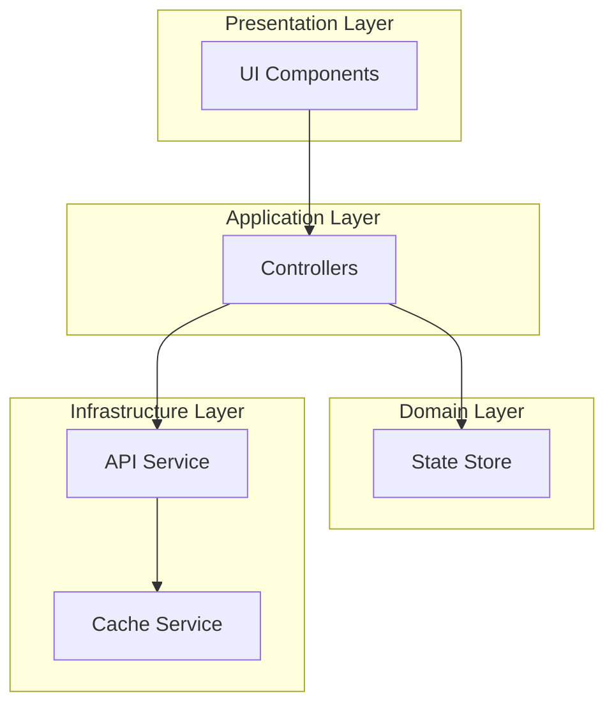
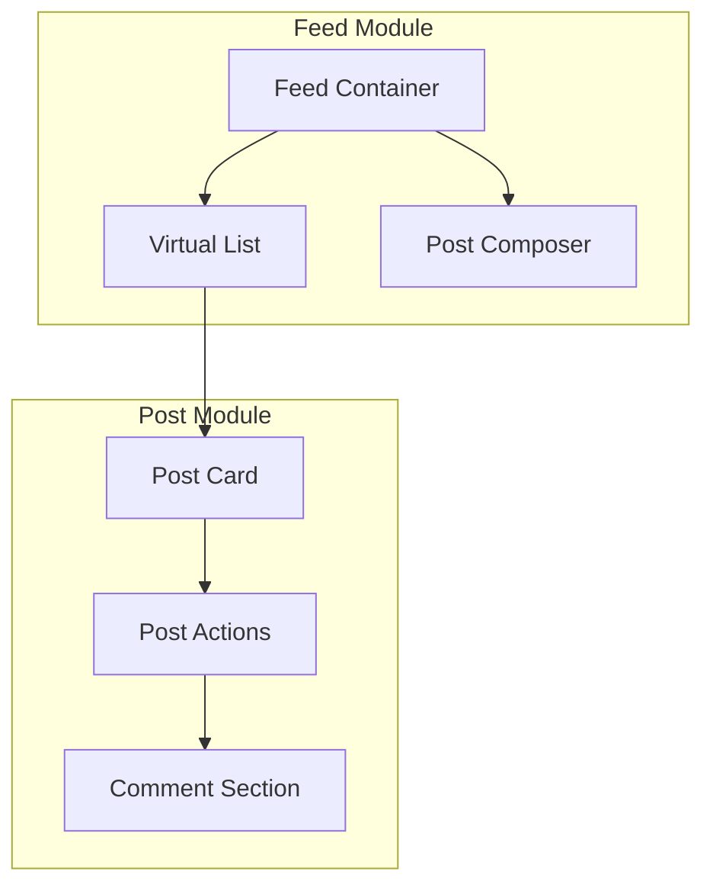
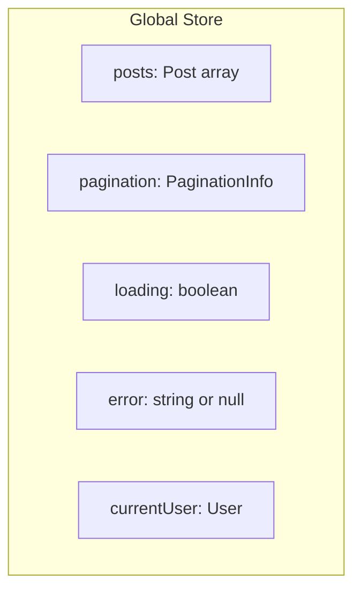
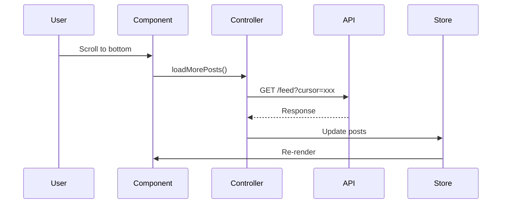
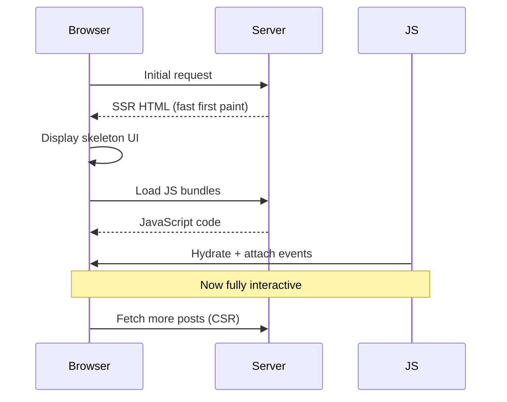

# News Feed System - High-Level Design (HLD)

## 1. Overview

This document describes the high-level architecture of a News Feed application similar to Facebook's feed.

### 1.1 Design Goals

| Goal | Description |
|------|-------------|
| **Performance** | Fast initial load, smooth infinite scroll |
| **Scalability** | Handle feeds with 10,000+ posts |
| **Maintainability** | Clean separation of concerns |
| **User Experience** | Responsive, accessible, intuitive |

---

## 2. System Architecture

### 2.1 Layered Architecture



### 2.2 Component Architecture



---

## 3. Core Components

### 3.1 Feed Container

- Orchestrates the entire feed experience
- Infinite scroll with virtualization
- Pull-to-refresh capability
- Error boundary wrapper

### 3.2 Post Card Layout

```
┌─────────────────────────────────────────┐
│ [Avatar] Author Name         • 2h ago   │
├─────────────────────────────────────────┤
│  Post content goes here...              │
│  [Image if present]                     │
├─────────────────────────────────────────┤
│ 👍 1.2K  💬 234 comments               │
├─────────────────────────────────────────┤
│  [👍 Like]    [💬 Comment]   [↗ Share] │
└─────────────────────────────────────────┘
```

---

## 4. State Management

### 4.1 Store Structure



### 4.2 Data Flow



---

## 5. API Endpoints

| Endpoint | Method | Description |
|----------|--------|-------------|
| `/feed` | GET | Fetch paginated feed |
| `/posts` | POST | Create new post |
| `/posts/:id/reactions` | POST | Add reaction |
| `/posts/:id/comments` | GET/POST | Comments |

---

## 6. Performance Strategies

| Strategy | Description |
|----------|-------------|
| **Virtualization** | Only render visible posts |
| **Lazy Loading** | Load images on intersection |
| **Memoization** | Prevent unnecessary re-renders |
| **Caching** | Cache API responses |

---

## 7. Technology Stack

| Layer | Technology |
|-------|------------|
| **UI** | React 18+ |
| **Language** | TypeScript |
| **State** | Context + Reducer |
| **Styling** | CSS Modules |
| **Build** | Vite |

---

## 8. Rendering Approach

### SSR vs CSR vs Hybrid

| Approach | Initial Load | Interactivity | SEO | Use Case |
|----------|--------------|---------------|-----|----------|
| **SSR** | Fast | Slower | ✅ Good | Blogs, E-commerce |
| **CSR** | Slower | Fast | ❌ Poor | Dashboards, SPAs |
| **Hybrid** | Fast | Fast | ✅ Good | **News Feeds** |

### Facebook's Approach

Facebook uses a **Hybrid approach**:



---

## 9. Accessibility

### ARIA Requirements

| Element | ARIA Attribute | Purpose |
|---------|----------------|---------|
| Feed container | `role="feed"` | Indicates scrollable feed |
| Post | `role="article"` | Semantic article |
| Post | `aria-labelledby` | Links to author name |
| Like button | `aria-pressed` | Toggle state |
| Reaction picker | `role="listbox"` | Selection interface |

### Keyboard Navigation

| Key | Action |
|-----|--------|
| Tab | Navigate between posts and actions |
| Enter/Space | Activate buttons |
| Escape | Close reaction picker |
| Arrow keys | Navigate within picker |

