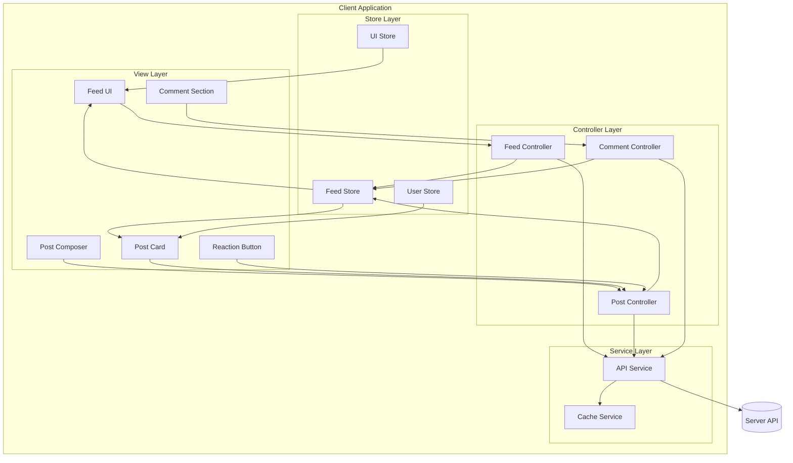
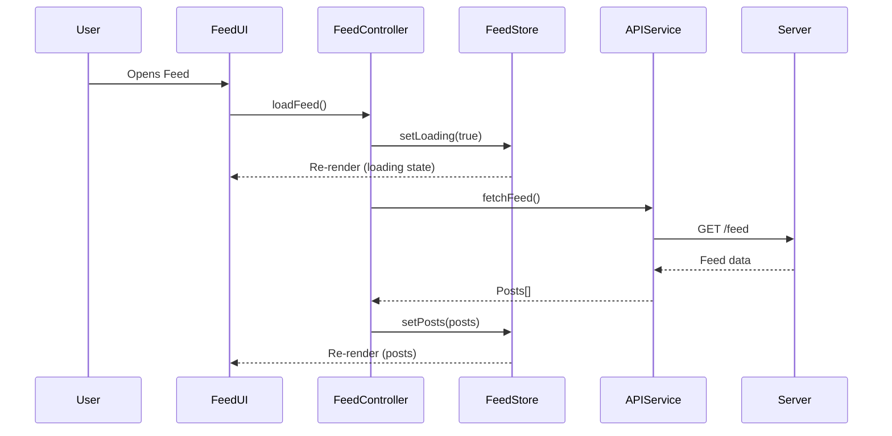
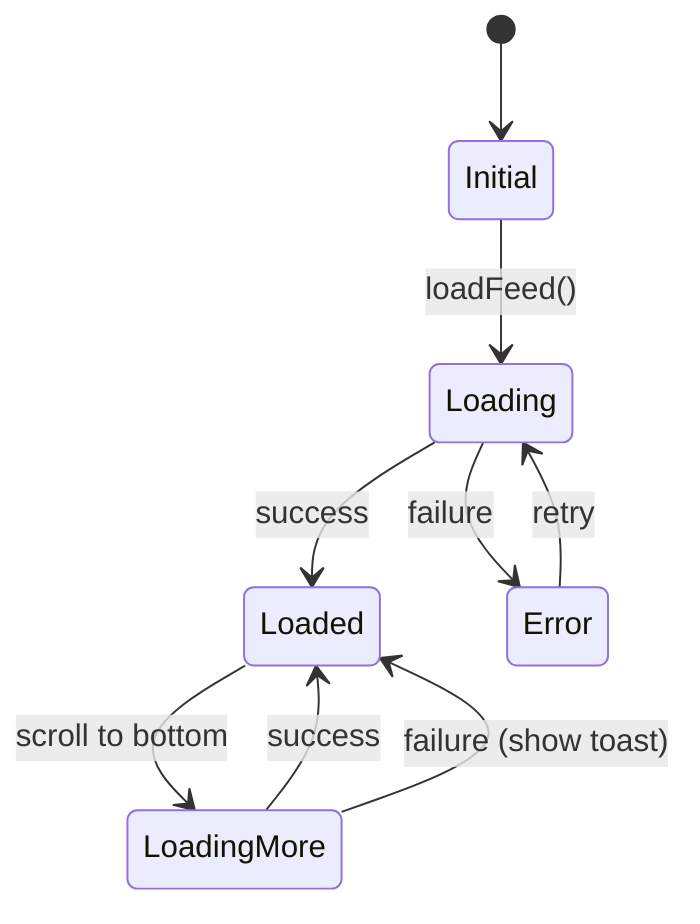

# News Feed System Design - RADIO Framework Analysis

## Overview

This document provides a comprehensive Front End System Design analysis for a **News Feed application** (similar to Facebook) using the **RADIO framework**. This analysis follows the approach recommended for Front End Engineer system design interviews.

---

## Table of Contents

1. [Requirements Exploration](#1-requirements-exploration)
2. [Architecture / High-Level Design](#2-architecture--high-level-design)
3. [Data Model](#3-data-model)
4. [Interface Definition (API)](#4-interface-definition-api)
5. [Optimizations and Deep Dive](#5-optimizations-and-deep-dive)

---

## 1. Requirements Exploration

> **Objective**: Understand the problem thoroughly and determine the scope by asking clarifying questions.
> 
> **Recommended Duration**: ~15% of interview time

### 1.1 Clarifying Questions

| Question | Answer |
|----------|--------|
| What are the main use cases? | View feed, create posts, react to posts, comment on posts |
| What devices need to be supported? | Desktop web (primary), mobile web (responsive) |
| Is offline support necessary? | Nice-to-have, not critical |
| What are the performance requirements? | Initial load < 3s, interaction response < 100ms |
| Who are the main users? | General social media users |
| What content types are supported? | Text, images (video is out of scope) |

### 1.2 Functional Requirements

| Requirement | Priority | Description |
|-------------|----------|-------------|
| View Feed | P0 (Must) | Users can view a personalized feed of posts |
| Infinite Scroll | P0 (Must) | Load more posts as user scrolls down |
| Create Post | P0 (Must) | Users can create text/image posts |
| React to Post | P0 (Must) | Users can like/react to posts |
| View Comments | P1 (Should) | Users can view comments on posts |
| Add Comment | P1 (Should) | Users can add comments to posts |
| Share Post | P2 (Could) | Users can share posts (out of scope) |

### 1.3 Non-Functional Requirements

| Requirement | Description |
|-------------|-------------|
| **Performance** | Fast initial load, smooth scrolling, responsive interactions |
| **Scalability** | Handle thousands of posts without performance degradation |
| **User Experience** | Loading states, error handling, optimistic updates |
| **Accessibility** | Screen reader support, keyboard navigation |
| **Security** | XSS prevention, input sanitization |

### 1.4 Out of Scope

- Real-time notifications (WebSocket)
- Video content
- Stories feature
- Direct messaging
- User profile pages
- Friend/Follow system

---

## 2. Architecture / High-Level Design

> **Objective**: Identify the key components of the product and how they are related to each other.
> 
> **Recommended Duration**: ~20% of interview time

### 2.1 Architecture Diagram



### 2.2 Component Responsibilities

| Component | Responsibility |
|-----------|----------------|
| **Feed UI** | Main container, renders list of posts, handles infinite scroll |
| **Post Composer** | UI for creating new posts (text + image upload) |
| **Post Card** | Displays individual post content, author info, reactions |
| **Comment Section** | Displays comments, allows adding new comments |
| **Reaction Button** | Handles like/reaction interactions |
| **Feed Controller** | Orchestrates feed data fetching, pagination logic |
| **Post Controller** | Handles post creation, reactions, updates |
| **Comment Controller** | Handles comment CRUD operations |
| **Feed Store** | Central store for feed posts data |
| **User Store** | Stores current user and cached user data |
| **UI Store** | Ephemeral UI state (loading, modals, etc.) |
| **API Service** | HTTP client for server communication |
| **Cache Service** | Client-side caching for API responses |

### 2.3 Data Flow



### 2.4 Rendering Approach

News feed applications have a mix of static content and interactive elements. There are three main rendering strategies:

| Approach | Description | Best For |
|----------|-------------|----------|
| **SSR** | Render HTML on server | Static content, SEO |
| **CSR** | Render in browser with JS | Interactive apps, dashboards |
| **Hybrid** | SSR initial + CSR for interactions | News feeds, social media |

**Recommendation for News Feed:** Use **Hybrid approach**:
1. **Initial load**: Server-side render the first screen for fast First Contentful Paint
2. **Hydration**: Attach event listeners for interactivity
3. **Subsequent content**: Client-side render new posts (infinite scroll, navigation)

This is how Facebook renders their feed - fast initial load with SSR, then CSR for interactions.

### 2.5 Code Splitting Tiers (Facebook's Approach)

```mermaid
gantt
    title JavaScript Loading Tiers
    dateFormat  X
    axisFormat %s
    
    section Tier 1
    Basic layout + skeletons    :0, 1
    
    section Tier 2  
    Above-fold content          :1, 2
    
    section Tier 3
    Logging, live updates       :2, 3
```



| Tier | Contents | Priority |
|------|----------|----------|
| **Tier 1** | Basic layout, UI skeletons for loading states | Critical |
| **Tier 2** | JavaScript to fully render above-the-fold content | High |
| **Tier 3** | Logging, analytics, live update subscriptions | Low |

---

## 3. Data Model

> **Objective**: Describe the various data entities, the fields they contain and which component(s) they belong to.
> 
> **Recommended Duration**: ~10% of interview time

### 3.1 Core Entities

#### User Entity

```typescript
interface User {
  id: string;
  name: string;
  username: string;
  avatarUrl: string;
  isVerified?: boolean;
}
```

| Field | Type | Source | Description |
|-------|------|--------|-------------|
| id | string | Server | Unique user identifier |
| name | string | Server | Display name |
| username | string | Server | Unique username/handle |
| avatarUrl | string | Server | Profile picture URL |
| isVerified | boolean | Server | Verification badge |

#### Post Entity

```typescript
interface Post {
  id: string;
  author: User;
  content: string;
  imageUrl?: string;
  createdAt: number; // Unix timestamp
  reactions: ReactionCounts;
  commentCount: number;
  userReaction?: ReactionType;
}

interface ReactionCounts {
  like: number;
  love: number;
  haha: number;
  wow: number;
  sad: number;
  angry: number;
}

type ReactionType = 'like' | 'love' | 'haha' | 'wow' | 'sad' | 'angry';
```

| Field | Type | Source | Description |
|-------|------|--------|-------------|
| id | string | Server | Unique post identifier |
| author | User | Server | Post author information |
| content | string | Server | Post text content |
| imageUrl | string? | Server | Optional image attachment |
| createdAt | number | Server | Creation timestamp |
| reactions | object | Server | Reaction counts by type |
| commentCount | number | Server | Total comment count |
| userReaction | string? | Server | Current user's reaction |

#### Comment Entity

```typescript
interface Comment {
  id: string;
  postId: string;
  author: User;
  content: string;
  createdAt: number;
  likeCount: number;
  isLiked: boolean;
}
```

#### Feed Entity (Client State)

```typescript
interface FeedState {
  posts: Post[];
  pagination: PaginationInfo;
  isLoading: boolean;
  isLoadingMore: boolean;
  error: string | null;
}

interface PaginationInfo {
  cursor: string | null;
  hasMore: boolean;
  pageSize: number;
}
```

### 3.2 Client-Only State

| State | Component | Purpose |
|-------|-----------|---------|
| `isComposerOpen` | Post Composer | Toggle composer modal |
| `composerDraft` | Post Composer | Unsaved post content |
| `expandedComments` | Post Card | Set of post IDs with expanded comments |
| `reactionPickerPostId` | Post Card | Which post's reaction picker is open |

### 3.3 Normalized vs Denormalized Store

> **Advanced Topic**: Facebook uses Relay and Twitter uses Redux with normalized stores.

**Denormalized (Simple):**
```typescript
// Store the response as-is
interface FeedStore {
  posts: Post[]; // Each post contains full author object
}
```

**Normalized (Advanced):**
```typescript
// Like a database with foreign keys
interface NormalizedStore {
  users: { [id: string]: User };
  posts: { [id: string]: PostWithAuthorId };
  feed: string[]; // Array of post IDs
}
```

| Aspect | Denormalized | Normalized |
|--------|--------------|------------|
| **Complexity** | Simple | Complex |
| **Duplicated data** | Yes (author in every post) | No |
| **Update consistency** | Hard (update all copies) | Easy (single source) |
| **Use case** | Simple feeds | Complex apps with related data |

**Recommendation for interviews:** Use denormalized for simplicity. Mention normalized as an optimization.

---

## 4. Interface Definition (API)

> **Objective**: Define the interface (API) between components in the product.
> 
> **Recommended Duration**: ~15% of interview time

### 4.1 Server-Client API

#### GET /feed - Fetch Feed Posts

```typescript
// Request
GET /feed?cursor={cursor}&size={size}

// Query Parameters
interface FeedRequest {
  cursor?: string;  // Pagination cursor (optional for first page)
  size?: number;    // Page size (default: 10)
}

// Response
interface FeedResponse {
  posts: Post[];
  pagination: {
    nextCursor: string | null;
    hasMore: boolean;
  };
}
```

#### POST /posts - Create New Post

```typescript
// Request
POST /posts
Content-Type: application/json

interface CreatePostRequest {
  content: string;
  imageUrl?: string;
}

// Response
interface CreatePostResponse {
  post: Post;
}
```

#### POST /posts/:postId/reactions - Add Reaction

```typescript
// Request
POST /posts/:postId/reactions
Content-Type: application/json

interface AddReactionRequest {
  type: ReactionType;
}

// Response
interface AddReactionResponse {
  reactions: ReactionCounts;
  userReaction: ReactionType;
}
```

#### DELETE /posts/:postId/reactions - Remove Reaction

```typescript
// Request
DELETE /posts/:postId/reactions

// Response
interface RemoveReactionResponse {
  reactions: ReactionCounts;
  userReaction: null;
}
```

#### GET /posts/:postId/comments - Fetch Comments

```typescript
// Request
GET /posts/:postId/comments?cursor={cursor}&size={size}

// Response
interface CommentsResponse {
  comments: Comment[];
  pagination: {
    nextCursor: string | null;
    hasMore: boolean;
  };
}
```

#### POST /posts/:postId/comments - Add Comment

```typescript
// Request
POST /posts/:postId/comments
Content-Type: application/json

interface AddCommentRequest {
  content: string;
}

// Response
interface AddCommentResponse {
  comment: Comment;
}
```

### 4.2 Component APIs (Props)

#### FeedComponent

```typescript
interface FeedProps {
  initialPosts?: Post[];
  onLoadMore?: () => void;
  onPostCreated?: (post: Post) => void;
}
```

#### PostCardComponent

```typescript
interface PostCardProps {
  post: Post;
  onReact?: (postId: string, reaction: ReactionType) => void;
  onComment?: (postId: string, content: string) => void;
  onShare?: (postId: string) => void;
}
```

#### PostComposerComponent

```typescript
interface PostComposerProps {
  currentUser: User;
  onSubmit: (content: string, imageUrl?: string) => Promise<void>;
  onCancel?: () => void;
  isSubmitting?: boolean;
}
```

#### ReactionButtonComponent

```typescript
interface ReactionButtonProps {
  reactions: ReactionCounts;
  userReaction?: ReactionType;
  onReact: (type: ReactionType | null) => void;
}
```

### 4.3 GraphQL API (Alternative to REST)

> **Facebook uses Relay + GraphQL** for their feed. GraphQL offers advantages for complex, nested data.

#### GraphQL Schema

```graphql
type Query {
  feed(cursor: String, limit: Int): FeedConnection!
  post(id: ID!): Post
}

type Mutation {
  createPost(input: CreatePostInput!): Post!
  addReaction(postId: ID!, type: ReactionType!): Post!
  addComment(postId: ID!, content: String!): Comment!
}

type FeedConnection {
  edges: [PostEdge!]!
  pageInfo: PageInfo!
}

type PostEdge {
  node: Post!
  cursor: String!
}

type Post {
  id: ID!
  author: User!
  content: String!
  imageUrl: String
  createdAt: DateTime!
  reactions: ReactionCounts!
  comments(first: Int, after: String): CommentConnection!
  viewerReaction: ReactionType
}
```

#### Data-Driven Dependencies (Relay)

Facebook fetches component code along with data using `@match` and `@module`:

```graphql
fragment PostContent on Post {
  content
  ... on TextPost {
    @module('TextPostComponent.js')
    textContent
  }
  ... on ImagePost {
    @module('ImagePostComponent.js')
    imageData {
      src
      alt
      dimensions
    }
  }
  ... on VideoPost {
    @module('VideoPostComponent.js')
    videoUrl
    thumbnailUrl
  }
}
```

**Benefits:**
- Load only the JS needed for each post type
- No upfront loading of all 50+ post format components
- Code and data fetched together (no extra round-trip)

### 4.4 TanStack Query (React Query v5)

> Modern alternative to manual state management. Provides caching, background refetch, optimistic updates out of the box.

#### Setup

```typescript
import { QueryClient, QueryClientProvider } from '@tanstack/react-query';

const queryClient = new QueryClient({
  defaultOptions: {
    queries: {
      staleTime: 5 * 60 * 1000, // 5 minutes
      gcTime: 30 * 60 * 1000,   // 30 minutes (formerly cacheTime)
      refetchOnWindowFocus: true,
      retry: 3,
    },
  },
});

function App() {
  return (
    <QueryClientProvider client={queryClient}>
      <Feed />
    </QueryClientProvider>
  );
}
```

#### Infinite Query for Feed

```typescript
import { useInfiniteQuery } from '@tanstack/react-query';

function useFeed() {
  return useInfiniteQuery({
    queryKey: ['feed'],
    queryFn: ({ pageParam }) => api.fetchFeed(pageParam),
    initialPageParam: null as string | null,
    getNextPageParam: (lastPage) => lastPage.pagination.nextCursor,
    select: (data) => ({
      posts: data.pages.flatMap(page => page.posts),
      hasMore: data.pages.at(-1)?.pagination.hasMore ?? false,
    }),
  });
}

// Usage
function Feed() {
  const { data, fetchNextPage, hasNextPage, isFetchingNextPage } = useFeed();
  
  return (
    <>
      {data?.posts.map(post => <PostCard key={post.id} post={post} />)}
      {hasNextPage && (
        <button onClick={() => fetchNextPage()} disabled={isFetchingNextPage}>
          {isFetchingNextPage ? 'Loading...' : 'Load More'}
        </button>
      )}
    </>
  );
}
```

#### Optimistic Updates with Mutations

```typescript
import { useMutation, useQueryClient } from '@tanstack/react-query';

function useReaction(postId: string) {
  const queryClient = useQueryClient();

  return useMutation({
    mutationFn: (type: ReactionType) => api.addReaction(postId, type),
    
    // Optimistic update
    onMutate: async (type) => {
      await queryClient.cancelQueries({ queryKey: ['feed'] });
      
      const previousData = queryClient.getQueryData(['feed']);
      
      queryClient.setQueryData(['feed'], (old: FeedData) => ({
        ...old,
        pages: old.pages.map(page => ({
          ...page,
          posts: page.posts.map(post => 
            post.id === postId
              ? { ...post, userReaction: type, reactions: { ...post.reactions, [type]: post.reactions[type] + 1 } }
              : post
          ),
        })),
      }));
      
      return { previousData };
    },
    
    // Rollback on error
    onError: (err, variables, context) => {
      queryClient.setQueryData(['feed'], context?.previousData);
    },
    
    // Always refetch after mutation
    onSettled: () => {
      queryClient.invalidateQueries({ queryKey: ['feed'] });
    },
  });
}
```

#### Comparison: React Query vs Manual State

| Feature | Manual (Context/Redux) | TanStack Query |
|---------|------------------------|----------------|
| Caching | DIY | ✅ Built-in |
| Background refetch | DIY | ✅ Built-in |
| Optimistic updates | DIY | ✅ Built-in |
| Request deduplication | DIY | ✅ Built-in |
| Retry logic | DIY | ✅ Built-in |
| DevTools | Limited | ✅ Excellent |
| Bundle size | Smaller | ~13KB gzipped |
| Learning curve | Lower | Medium |

**Recommendation:** Use TanStack Query for production apps. Manual state is fine for interviews to demonstrate understanding.

---

## 5. Optimizations and Deep Dive

> **Objective**: Discuss possible optimization opportunities and specific areas of interest.
> 
> **Recommended Duration**: ~40% of interview time

### 5.1 Performance Optimizations

#### Virtualized List (Windowing)

Only render posts that are visible in the viewport to handle large feeds efficiently.

```typescript
// Using a virtualization library concept
interface VirtualListConfig {
  itemHeight: number | ((index: number) => number);
  overscan: number; // Extra items to render above/below viewport
  containerHeight: number;
}
```

**Benefits:**
- Reduces DOM nodes from thousands to ~20-30
- Constant memory usage regardless of feed size
- Maintains smooth 60fps scrolling

#### Image Lazy Loading

```typescript
// Use Intersection Observer for lazy loading
const lazyLoadImage = (imgElement: HTMLImageElement) => {
  const observer = new IntersectionObserver((entries) => {
    entries.forEach(entry => {
      if (entry.isIntersecting) {
        imgElement.src = imgElement.dataset.src!;
        observer.unobserve(imgElement);
      }
    });
  });
  observer.observe(imgElement);
};
```

#### Debounced Scroll Handler

```typescript
const handleScroll = debounce(() => {
  if (isNearBottom() && hasMorePosts && !isLoading) {
    loadMorePosts();
  }
}, 100);
```

#### Memoization

```typescript
// React example
const PostCard = React.memo(({ post, onReact }) => {
  // Only re-renders if post or onReact changes
  return <div>...</div>;
});

// useCallback for stable function references
const handleReact = useCallback((type: ReactionType) => {
  reactToPost(post.id, type);
}, [post.id]);
```

#### Facebook's Virtualization Technique

Facebook doesn't remove off-screen posts entirely - they replace contents with empty `<div>`s:

```typescript
function VirtualizedPost({ post, isVisible }: { post: Post; isVisible: boolean }) {
  const [measuredHeight, setMeasuredHeight] = useState(0);
  const ref = useRef<HTMLDivElement>(null);

  useEffect(() => {
    if (ref.current && isVisible) {
      setMeasuredHeight(ref.current.offsetHeight);
    }
  }, [isVisible]);

  if (!isVisible) {
    // Off-screen: render placeholder with measured height
    return (
      <div 
        style={{ height: measuredHeight }} 
        hidden 
        aria-hidden="true"
      />
    );
  }

  return (
    <article ref={ref}>
      <PostCard post={post} />
    </article>
  );
}
```

#### Dynamic Loading Count

Customize page size based on viewport height:

```typescript
function calculatePageSize(): number {
  const viewportHeight = window.innerHeight;
  const estimatedPostHeight = 400; // pixels
  const postsPerViewport = Math.ceil(viewportHeight / estimatedPostHeight);
  
  // Fetch 2x viewport for buffer, min 5, max 20
  return Math.min(20, Math.max(5, postsPerViewport * 2));
}

// First load: conservative estimate (don't know viewport yet)
const INITIAL_PAGE_SIZE = 10;

// Subsequent loads: based on actual viewport
function useDynamicPageSize() {
  const [pageSize, setPageSize] = useState(INITIAL_PAGE_SIZE);
  
  useEffect(() => {
    setPageSize(calculatePageSize());
  }, []);
  
  return pageSize;
}
```

#### Preserving Scroll Position

Save and restore scroll position when navigating away and back:

```typescript
// Store scroll position before navigation
const scrollPositions = new Map<string, number>();

function useSaveScrollPosition(key: string) {
  useEffect(() => {
    // Restore on mount
    const saved = scrollPositions.get(key);
    if (saved) {
      window.scrollTo(0, saved);
    }

    // Save on unmount
    return () => {
      scrollPositions.set(key, window.scrollY);
    };
  }, [key]);
}

// Usage in Feed component
function Feed() {
  useSaveScrollPosition('feed');
  // ...
}
```

#### Stale Feed Detection

Prompt user to refresh if feed is old:

```typescript
const STALE_THRESHOLD = 2 * 60 * 60 * 1000; // 2 hours

function useStaleFeedDetection(lastFetchTime: number) {
  const [isStale, setIsStale] = useState(false);

  useEffect(() => {
    const checkStale = () => {
      setIsStale(Date.now() - lastFetchTime > STALE_THRESHOLD);
    };

    // Check on visibility change (user returns to tab)
    const handleVisibility = () => {
      if (document.visibilityState === 'visible') {
        checkStale();
      }
    };

    document.addEventListener('visibilitychange', handleVisibility);
    return () => document.removeEventListener('visibilitychange', handleVisibility);
  }, [lastFetchTime]);

  return isStale;
}

// UI Component
function StaleFeedBanner({ onRefresh }) {
  return (
    <div className="stale-banner" role="alert">
      <p>Your feed may be outdated</p>
      <button onClick={onRefresh}>Refresh</button>
    </div>
  );
}
```

#### Prefetching Next Page

Load next page before user reaches bottom:

```typescript
const PREFETCH_THRESHOLD = 0.7; // 70% scrolled

function usePrefetch(loadMore: () => void, hasMore: boolean) {
  useEffect(() => {
    const handleScroll = throttle(() => {
      const scrollPercent = window.scrollY / 
        (document.documentElement.scrollHeight - window.innerHeight);
      
      if (scrollPercent > PREFETCH_THRESHOLD && hasMore) {
        loadMore();
      }
    }, 200);

    window.addEventListener('scroll', handleScroll);
    return () => window.removeEventListener('scroll', handleScroll);
  }, [loadMore, hasMore]);
}
```

### 5.2 User Experience (UX)

#### Optimistic Updates

Update UI immediately before server confirmation for instant feedback.

```typescript
const handleReaction = async (type: ReactionType) => {
  // Optimistic update
  const previousReaction = post.userReaction;
  updatePostReaction(post.id, type); // Update store immediately
  
  try {
    await api.addReaction(post.id, type);
  } catch (error) {
    // Rollback on failure
    updatePostReaction(post.id, previousReaction);
    showErrorToast('Failed to add reaction');
  }
};
```

#### Loading States



**Skeleton Loading:**

```typescript
// Show placeholders while loading
const PostSkeleton = () => (
  <div className="post-skeleton">
    <div className="skeleton-avatar" />
    <div className="skeleton-content">
      <div className="skeleton-line" />
      <div className="skeleton-line short" />
    </div>
  </div>
);
```

#### Error Handling

| Error Type | UI Response |
|------------|-------------|
| Network error | Show retry button, toast message |
| 401 Unauthorized | Redirect to login |
| 404 Post not found | Remove from feed, show toast |
| 500 Server error | Show retry option |
| Rate limited | Show cooldown message |

### 5.3 Accessibility (a11y)

#### ARIA Labels

```html
<button 
  aria-label="Like this post by John Doe"
  aria-pressed="false"
  role="button"
>
  👍 Like
</button>

<article 
  role="article" 
  aria-labelledby="post-123-author"
>
  <header>
    <h2 id="post-123-author">Post by John Doe</h2>
  </header>
  ...
</article>
```

#### Keyboard Navigation

| Key | Action |
|-----|--------|
| Tab | Move focus between interactive elements |
| Enter/Space | Activate buttons, submit forms |
| Escape | Close modals, reaction picker |
| Arrow keys | Navigate within reaction picker |

#### Focus Management

```typescript
// Return focus after modal close
const handleCloseComposer = () => {
  setIsOpen(false);
  // Return focus to trigger button
  triggerButtonRef.current?.focus();
};
```

### 5.4 Network Optimization

#### Request Deduplication

```typescript
class APIService {
  private pendingRequests = new Map<string, Promise<any>>();
  
  async fetch(url: string): Promise<any> {
    if (this.pendingRequests.has(url)) {
      return this.pendingRequests.get(url);
    }
    
    const request = fetch(url).then(r => r.json());
    this.pendingRequests.set(url, request);
    
    try {
      return await request;
    } finally {
      this.pendingRequests.delete(url);
    }
  }
}
```

#### Caching Strategy

```typescript
interface CacheEntry<T> {
  data: T;
  timestamp: number;
  ttl: number; // Time to live in ms
}

class CacheService {
  private cache = new Map<string, CacheEntry<any>>();
  
  get<T>(key: string): T | null {
    const entry = this.cache.get(key);
    if (!entry) return null;
    
    if (Date.now() - entry.timestamp > entry.ttl) {
      this.cache.delete(key);
      return null;
    }
    
    return entry.data;
  }
  
  set<T>(key: string, data: T, ttl = 60000): void {
    this.cache.set(key, { data, timestamp: Date.now(), ttl });
  }
}
```

#### Pagination Strategies: Offset vs Cursor

##### Offset-based Pagination

```typescript
// Request: GET /feed?page=2&size=5
// SQL: SELECT * FROM posts LIMIT 5 OFFSET 5;
```

**Problem:** When new posts are added, offset shifts:
```
Initial:  A, B, C, D, E  (Page 1)
New posts added: K, L, M, N, O
Page 2 now returns: A, B, C, D, E  ❌ Duplicates!
```

##### Cursor-based Pagination

```typescript
// Request: GET /feed?cursor=post_E_id&size=5
// SQL: SELECT * FROM posts WHERE id < cursor LIMIT 5;
```

**Benefit:** Cursor is fixed, new posts don't affect results:
```
Initial:  A, B, C, D, E  (cursor points to E)
New posts added: K, L, M, N, O
Next page returns: F, G, H, I, J  ✅ Correct!
```

| Aspect | Offset-based | Cursor-based |
|--------|--------------|---------------|
| **Jump to page** | ✅ Yes | ❌ No |
| **Real-time data** | ❌ Duplicates/gaps | ✅ Consistent |
| **Performance** | ❌ Degrades with offset | ✅ Constant |
| **Implementation** | ✅ Simple | ⚠️ Slightly complex |

**Recommendation:** Use **cursor-based** pagination for news feeds.

### 5.5 Security

#### XSS Prevention

```typescript
// Sanitize user-generated content
import DOMPurify from 'dompurify';

const sanitizeContent = (content: string): string => {
  return DOMPurify.sanitize(content, {
    ALLOWED_TAGS: ['b', 'i', 'em', 'strong', 'a'],
    ALLOWED_ATTR: ['href']
  });
};

// In React, use textContent or proper escaping
<p>{post.content}</p> // React auto-escapes
```

#### Image URL Validation

```typescript
const isValidImageUrl = (url: string): boolean => {
  try {
    const parsed = new URL(url);
    return ['https:'].includes(parsed.protocol);
  } catch {
    return false;
  }
};
```

### 5.6 Internationalization (i18n)

```typescript
// Time formatting
const formatRelativeTime = (timestamp: number, locale: string): string => {
  const rtf = new Intl.RelativeTimeFormat(locale, { numeric: 'auto' });
  const diff = Date.now() - timestamp;
  
  if (diff < 60000) return rtf.format(-Math.floor(diff / 1000), 'second');
  if (diff < 3600000) return rtf.format(-Math.floor(diff / 60000), 'minute');
  if (diff < 86400000) return rtf.format(-Math.floor(diff / 3600000), 'hour');
  return rtf.format(-Math.floor(diff / 86400000), 'day');
};

// Number formatting
const formatNumber = (num: number, locale: string): string => {
  return new Intl.NumberFormat(locale, { notation: 'compact' }).format(num);
};
// formatNumber(1500, 'en') => "1.5K"
// formatNumber(1500, 'vi') => "1,5 N"
```

### 5.7 Live Updates

For real-time comment/reaction updates, there are several approaches:

| Method | Description | Latency | Complexity |
|--------|-------------|---------|------------|
| **Short Polling** | Client requests at intervals | High | Low |
| **Long Polling** | Server holds connection until data | Medium | Medium |
| **SSE** | Server pushes over HTTP | Low | Medium |
| **WebSocket** | Full-duplex connection | Very Low | High |

**Facebook uses WebSocket** for live updates.

**Smart Subscription Pattern:**
```typescript
// Only subscribe to updates for visible posts
useEffect(() => {
  if (isVisible) {
    subscribeToUpdates(postId);
    return () => unsubscribeFromUpdates(postId);
  }
}, [isVisible, postId]);
```

**Throttling for Popular Posts:**
- Posts with many followers receive frequent updates
- Debounce/throttle updates to avoid overwhelming the UI
- Beyond threshold, just show "X new comments" instead of live stream

### 5.8 Feed Post Optimizations

#### Lazy Load Non-Critical UI

Load code for rarely-used features on demand:
- Reaction picker popover
- Share modal
- Additional actions menu
- Emoji/sticker pickers

#### Timestamp Freshness

Relative timestamps can become stale. Use a timer to update recent posts:

```typescript
useEffect(() => {
  if (isRecent(post.createdAt)) {
    const timer = setInterval(() => {
      setDisplayTime(formatRelativeTime(post.createdAt));
    }, 60000); // Update every minute
    return () => clearInterval(timer);
  }
}, [post.createdAt]);
```

#### Icon Rendering

| Approach | Pros | Cons |
|----------|------|------|
| Separate images | Simple | Multiple HTTP requests |
| Spritesheet | One request | Complex setup |
| Icon fonts | Scalable | Flash of unstyled content |
| **Inline SVG** | Scalable, no flash | Cannot cache |

**Facebook/Twitter use inline SVGs** - the modern standard.

#### Image Optimization

**CDN & Modern Formats:**
```typescript
// Use CDN with WebP format
const getOptimizedImageUrl = (url: string, width: number) => {
  return `https://cdn.example.com/image?url=${encodeURIComponent(url)}&w=${width}&format=webp`;
};
```

**Responsive Images with srcset:**
```html

```

**Network-Adaptive Loading:**
```typescript
function useNetworkAdaptiveImage(src: string) {
  const [quality, setQuality] = useState<'high' | 'low'>('high');

  useEffect(() => {
    // Check network speed
    const connection = (navigator as any).connection;
    if (connection) {
      const isSlowNetwork = connection.effectiveType === '2g' || 
                            connection.effectiveType === 'slow-2g';
      setQuality(isSlowNetwork ? 'low' : 'high');
    }
  }, []);

  return quality === 'low' 
    ? `${src}?quality=low&blur=true` 
    : src;
}
```

#### Post Truncation

Truncate long posts with "See more" button:

```typescript
const MAX_LENGTH = 300;

function TruncatedContent({ content }: { content: string }) {
  const [expanded, setExpanded] = useState(false);
  const shouldTruncate = content.length > MAX_LENGTH;

  if (!shouldTruncate || expanded) {
    return <p>{content}</p>;
  }

  return (
    <p>
      {content.slice(0, MAX_LENGTH)}...
      <button 
        className="see-more"
        onClick={() => setExpanded(true)}
        aria-expanded={expanded}
      >
        See more
      </button>
    </p>
  );
}
```

**Abbreviate Large Counts:**
```typescript
// Good: "John, Mary and 103K others"
// Bad: "John, Mary and 103,312 others"

function formatReactionSummary(
  reactions: ReactionCounts, 
  topReactors: User[]
): string {
  const total = getTotalReactions(reactions);
  if (total === 0) return '';
  
  const names = topReactors.slice(0, 2).map(u => u.name);
  const remaining = total - names.length;
  
  if (remaining === 0) return names.join(' and ');
  return `${names.join(', ')} and ${formatCount(remaining)} others`;
}
```

#### Keyboard Shortcuts

Facebook's feed keyboard navigation:

```typescript
const KEYBOARD_SHORTCUTS = {
  'j': 'nextPost',      // Navigate to next post
  'k': 'prevPost',      // Navigate to previous post
  'l': 'likePost',      // Like current post
  'c': 'focusComment',  // Focus comment input
  'enter': 'openPost',  // Open current post
  'escape': 'closeModal',
};

function useKeyboardNavigation(posts: Post[]) {
  const [focusedIndex, setFocusedIndex] = useState(-1);

  useEffect(() => {
    const handleKeyDown = (e: KeyboardEvent) => {
      // Don't trigger if user is typing
      if (e.target instanceof HTMLInputElement || 
          e.target instanceof HTMLTextAreaElement) {
        return;
      }

      switch (e.key.toLowerCase()) {
        case 'j':
          setFocusedIndex(i => Math.min(i + 1, posts.length - 1));
          break;
        case 'k':
          setFocusedIndex(i => Math.max(i - 1, 0));
          break;
        case 'l':
          if (focusedIndex >= 0) {
            toggleReaction(posts[focusedIndex].id, 'like');
          }
          break;
        case '?':
          if (e.shiftKey) {
            showShortcutsHelp();
          }
          break;
      }
    };

    window.addEventListener('keydown', handleKeyDown);
    return () => window.removeEventListener('keydown', handleKeyDown);
  }, [posts, focusedIndex]);

  return { focusedIndex, setFocusedIndex };
}
```

### 5.8.1 Feed Composer Optimizations

#### Lazy Load Composer Features

```typescript
// Lazy load non-critical composer features
const ImageUploader = React.lazy(() => import('./ImageUploader'));
const GifPicker = React.lazy(() => import('./GifPicker'));
const EmojiPicker = React.lazy(() => import('./EmojiPicker'));
const StickerPicker = React.lazy(() => import('./StickerPicker'));
const BackgroundPicker = React.lazy(() => import('./BackgroundPicker'));

function PostComposerActions() {
  const [activeFeature, setActiveFeature] = useState<string | null>(null);

  return (
    <div className="composer-actions">
      <button onClick={() => setActiveFeature('image')}>📷 Photo</button>
      <button onClick={() => setActiveFeature('gif')}>GIF</button>
      <button onClick={() => setActiveFeature('emoji')}>😀</button>
      
      <Suspense fallback={<LoadingSpinner />}>
        {activeFeature === 'image' && <ImageUploader />}
        {activeFeature === 'gif' && <GifPicker />}
        {activeFeature === 'emoji' && <EmojiPicker />}
      </Suspense>
    </div>
  );
}
```

### 5.8.2 Live Comment Updates

#### Subscribe/Unsubscribe Based on Visibility

```typescript
function useCommentSubscription(postId: string, isVisible: boolean) {
  const [comments, setComments] = useState<Comment[]>([]);

  useEffect(() => {
    if (!isVisible) return;

    const ws = new WebSocket(`wss://api.example.com/comments/${postId}`);
    
    ws.onmessage = (event) => {
      const update = JSON.parse(event.data);
      setComments(prev => [...prev, update.comment]);
    };

    return () => ws.close();
  }, [postId, isVisible]);

  return comments;
}
```

#### Throttling for Popular Posts

```typescript
const POPULAR_POST_THRESHOLD = 10000; // 10K followers

function useThrottledUpdates(postId: string, followerCount: number) {
  const isPopular = followerCount > POPULAR_POST_THRESHOLD;
  
  // Popular posts: show "X new comments" instead of live stream
  const [pendingCount, setPendingCount] = useState(0);

  const handleUpdate = useMemo(() => {
    if (isPopular) {
      // Throttle: batch updates every 10 seconds
      return throttle((update) => {
        setPendingCount(c => c + 1);
      }, 10000);
    }
    return (update) => applyUpdate(update);
  }, [isPopular]);

  return { pendingCount, handleUpdate };
}

// UI for popular posts
function PopularPostUpdates({ count, onLoad }: { count: number; onLoad: () => void }) {
  if (count === 0) return null;
  
  return (
    <button className="new-comments-banner" onClick={onLoad}>
      View {count} new comments
    </button>
  );
}
```


### 5.9 Meta's Technology Stack

> These are the actual technologies Meta uses for Facebook, Instagram, etc.

#### StyleX (CSS Solution)

Meta open-sourced **StyleX** in 2023. It's used across Facebook, Instagram, WhatsApp, Messenger, and Threads.

**Key Features:**
- **Atomic CSS**: Each property:value becomes a unique class
- **Static compilation**: No runtime CSS injection
- **80% CSS reduction**: Via deduplication of atomic classes
- **Type-safe**: Full TypeScript support
- **"Last style wins"**: Predictable merge behavior

```typescript
import * as stylex from '@stylexjs/stylex';

const styles = stylex.create({
  button: {
    backgroundColor: 'blue',
    padding: 16,
    borderRadius: 8,
  },
  primary: {
    backgroundColor: 'var(--primary)',
  },
});

// "Last style wins" - primary overrides button's backgroundColor
<button {...stylex.props(styles.button, styles.primary)} />
```

#### Lexical (Rich Text Editor)

Meta uses **Lexical** for post composers (successor to Draft.js).

**Key Features:**
- **Plugin architecture**: Mentions, hashtags, emojis, formatting
- **Performance**: Virtual DOM-like diffing
- **Extensible**: Custom nodes for any rich content
- **Serializable**: JSON state for storage

```typescript
// Editor state structure
{
  root: {
    children: [
      { type: 'paragraph', children: [
        { type: 'text', text: 'Hello ' },
        { type: 'mention', userId: '123', text: '@John' },
        { type: 'text', text: ' check out ' },
        { type: 'hashtag', tag: 'ReactJS' }
      ]}
    ]
  }
}
```

#### Relay (GraphQL Client)

- **Data-driven dependencies**: Load component code with data
- **Normalized cache**: Automatic cache updates
- **Optimistic updates**: Built-in support
- **Fragment colocation**: Components declare data needs

#### Technology Summary

| Layer | Technology | Purpose |
|-------|------------|---------|
| **UI Framework** | React | Component rendering |
| **Styling** | StyleX | Atomic CSS, type-safe |
| **Data Fetching** | Relay + GraphQL | Declarative data, caching |
| **Rich Text** | Lexical | Post/comment composition |
| **State** | Recoil/Relay | Client-side state |

---

## Summary

| Section | Key Points |
|---------|------------|
| **Requirements** | Core features: view feed, create posts, react, comment. Infinite scroll, mobile-friendly |
| **Architecture** | MVC pattern, hybrid SSR+CSR rendering, 3-tier JS loading |
| **Data Model** | Post, User, Comment entities. Denormalized or normalized store |
| **Interface** | REST or GraphQL API, cursor pagination, TanStack Query |
| **Optimizations** | Virtualization, lazy loading, optimistic updates, caching, prefetching |
| **Technologies** | StyleX (CSS), Lexical (editor), Relay (GraphQL), WebSocket (live updates) |

### Topics Covered

- ✅ Requirements exploration & clarifying questions
- ✅ Architecture diagrams (HLD, component diagram)
- ✅ Rendering approaches (SSR, CSR, Hybrid)
- ✅ Data model (entities, normalized vs denormalized)
- ✅ API design (REST, GraphQL, cursor vs offset pagination)
- ✅ TanStack Query (React Query v5) integration
- ✅ Virtualized lists (Facebook's technique)
- ✅ Infinite scroll with Intersection Observer
- ✅ Dynamic loading count based on viewport
- ✅ Scroll position preservation
- ✅ Stale feed detection
- ✅ Prefetching next page
- ✅ Optimistic updates with rollback
- ✅ Loading states & skeleton screens
- ✅ Image optimization (CDN, WebP, srcset, network-adaptive)
- ✅ Post truncation ("See more")
- ✅ Keyboard shortcuts (J/K/L navigation)
- ✅ Live comment updates (WebSocket)
- ✅ Subscribe/unsubscribe based on visibility
- ✅ Throttling for popular posts
- ✅ Feed composer lazy loading
- ✅ StyleX (Meta's CSS solution)
- ✅ Lexical (Meta's rich text editor)
- ✅ Accessibility (ARIA roles, keyboard nav)
- ✅ Security (XSS prevention)
- ✅ i18n (Intl API)
- ✅ Code splitting (3-tier approach)
- ✅ Caching strategies

---

## Interview Tips

1. **Start with requirements** - Ask clarifying questions before designing
2. **Draw diagrams** - Architecture diagrams, data flow, component hierarchy
3. **Discuss tradeoffs** - Offset vs cursor, REST vs GraphQL, normalized vs denormalized
4. **Focus on client-side** - Server is a black box, focus on FE architecture
5. **Cover unique aspects** - Infinite scroll, virtualization, optimistic updates
6. **Mention real implementations** - "Facebook uses StyleX for CSS, Lexical for editing"
7. **Think about scale** - What happens with 10K posts? Celebrity accounts?
8. **Don't forget accessibility** - role="feed", keyboard navigation, ARIA labels
9. **Performance matters** - Lazy loading, code splitting, prefetching
10. **Error handling** - Network failures, retry logic, error states

---

## References

- [Rebuilding our tech stack for the new Facebook.com](https://engineering.fb.com/2020/05/08/web/facebook-redesign/)
- [Making Facebook.com accessible to as many people as possible](https://engineering.fb.com/2020/07/30/web/facebook-com-accessibility/)
- [StyleX - A Styling Library for CSS at Scale](https://stylexjs.com)
- [Lexical - An extensible text editor framework](https://lexical.dev)
- [TanStack Query Documentation](https://tanstack.com/query/latest)
- [Evolving API Pagination at Slack](https://slack.engineering/evolving-api-pagination-at-slack/)
- [Making Instagram.com faster](https://instagram-engineering.com/making-instagram-com-faster-part-1-62cc0c327538)

